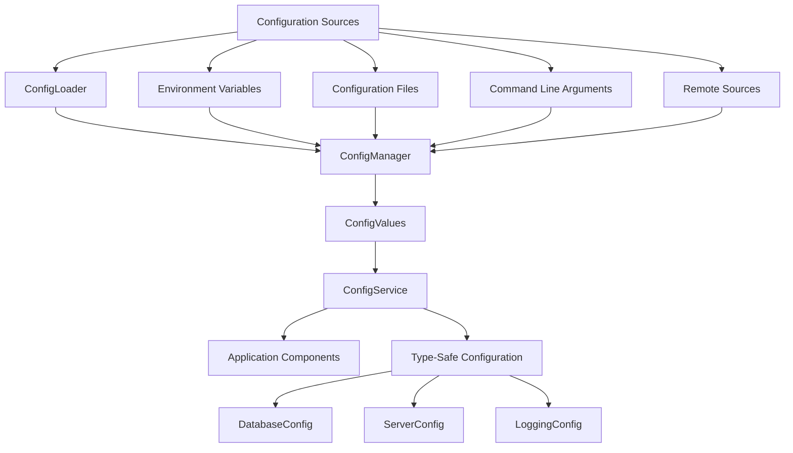

# Configuration API Reference

## Overview

The Configuration API in Navius provides a comprehensive set of interfaces and methods for managing application configuration, including loading configuration from multiple sources, accessing configuration values in a type-safe manner, and managing environment-specific settings.

## Core Interfaces

### ConfigLoader

The `ConfigLoader` trait defines the interface for loading configuration from various sources:

```rust
pub trait ConfigLoader: Send + Sync {
    /// Load configuration from a source
    fn load(&self) -> Result<ConfigValues, ConfigError>;
    
    /// Priority of this loader (higher numbers have higher precedence)
    fn priority(&self) -> i32;
}
```

### ConfigService

The `ConfigService` provides methods for accessing configuration values:

```rust
pub trait ConfigService: Send + Sync {
    /// Get a string value
    fn get_string(&self, key: &str) -> Result<String, ConfigError>;
    
    /// Get an integer value
    fn get_int(&self, key: &str) -> Result<i64, ConfigError>;
    
    /// Get a float value
    fn get_float(&self, key: &str) -> Result<f64, ConfigError>;
    
    /// Get a boolean value
    fn get_bool(&self, key: &str) -> Result<bool, ConfigError>;
    
    /// Get a complex value as a specific type
    fn get<T: DeserializeOwned>(&self, key: &str) -> Result<T, ConfigError>;
    
    /// Check if a configuration key exists
    fn has(&self, key: &str) -> bool;
}
```

### ConfigValues

The `ConfigValues` struct represents a hierarchical configuration structure:

```rust
pub struct ConfigValues {
    values: HashMap<String, ConfigValue>,
}

pub enum ConfigValue {
    String(String),
    Integer(i64),
    Float(f64),
    Boolean(bool),
    Array(Vec<ConfigValue>),
    Object(HashMap<String, ConfigValue>),
    Null,
}
```

## Implementation Details

### Configuration Flow

The following diagram illustrates how configuration is loaded and accessed in a Navius application:



### Loading Process

When configuration is loaded, the following process occurs:

1. Each `ConfigLoader` loads configuration from its source
2. The `ConfigManager` merges all configurations based on priority
3. Higher priority values override lower priority values
4. The merged configuration is made available through the `ConfigService`
5. Application components access the configuration via the `ConfigService`

## Common Operations

### Loading Configuration

```rust
// Create configuration loaders
let file_loader = FileConfigLoader::new("config")?;
let env_loader = EnvConfigLoader::new("APP_")?;

// Create configuration manager with loaders
let config_manager = ConfigManager::new(vec![
    Box::new(file_loader),
    Box::new(env_loader),
]);

// Load configuration
let config = config_manager.load()?;
```

### Accessing Configuration Values

```rust
// Get simple values
let server_host = config.get_string("server.host")?;
let server_port = config.get_int("server.port")?;
let debug_mode = config.get_bool("app.debug")?;

// Get typed configuration sections
let database_config = config.get::<DatabaseConfig>("database")?;
let logging_config = config.get::<LoggingConfig>("logging")?;
```

### Checking for Configuration Values

```rust
if config.has("feature.new_ui") {
    let enable_new_ui = config.get_bool("feature.new_ui")?;
    // Use the configuration value
}
```

### Working with Environment-Specific Configuration

```rust
// Get current environment
let environment = config.get_string("app.environment")
    .unwrap_or_else(|_| "development".to_string());

// Get environment-specific configuration key
let config_key = format!("{}.{}", environment, "database.url");
if config.has(&config_key) {
    let db_url = config.get_string(&config_key)?;
    // Use environment-specific database URL
} else {
    // Fall back to default database URL
    let db_url = config.get_string("database.url")?;
}
```

## Configuration Service API

The `ConfigService` trait provides methods for accessing configuration values in a type-safe manner.

### ConfigService Methods

| Method | Description | Parameters | Return Type |
|--------|-------------|------------|------------|
| `get_string` | Get a string value | `key: &str` | `Result<String, ConfigError>` |
| `get_int` | Get an integer value | `key: &str` | `Result<i64, ConfigError>` |
| `get_float` | Get a float value | `key: &str` | `Result<f64, ConfigError>` |
| `get_bool` | Get a boolean value | `key: &str` | `Result<bool, ConfigError>` |
| `get<T>` | Get a complex value as a specific type | `key: &str` | `Result<T, ConfigError>` |
| `has` | Check if a configuration key exists | `key: &str` | `bool` |

### Error Handling

The configuration API returns `ConfigError` for any operation that fails:

```rust
pub enum ConfigError {
    /// The specified key does not exist
    KeyNotFound(String),
    
    /// The value exists but has the wrong type
    TypeError {
        key: String,
        expected: String,
        actual: String,
    },
    
    /// Failed to load configuration from a source
    LoadError {
        source: String,
        reason: String,
    },
    
    /// Failed to parse configuration
    ParseError {
        source: String,
        reason: String,
    },
}
```

### Example Usage

```rust
fn configure_database(config: &dyn ConfigService) -> Result<DatabasePool, Error> {
    // Get database configuration
    let db_type = config.get_string("database.type")?;
    let db_url = config.get_string("database.url")?;
    let max_connections = config.get_int("database.max_connections").unwrap_or(10) as u32;
    
    // Create database pool based on type
    match db_type.as_str() {
        "postgres" => {
            DatabasePool::postgres(db_url, max_connections)
        },
        "mysql" => {
            DatabasePool::mysql(db_url, max_connections)
        },
        _ => {
            Err(Error::config_error(format!("Unsupported database type: {}", db_type)))
        }
    }
}
```

## Configuration Loaders

Navius provides several built-in configuration loaders:

### FileConfigLoader

Loads configuration from YAML, JSON, or TOML files:

```rust
// Create a file loader that looks for files in the specified directory
let file_loader = FileConfigLoader::new("config")?;

// Load configuration from default.yaml, environment-specific files, and local overrides
let config = file_loader.load()?;
```

### EnvConfigLoader

Loads configuration from environment variables:

```rust
// Create an environment variable loader with a specific prefix
let env_loader = EnvConfigLoader::new("APP_")?;

// Load configuration from environment variables
let config = env_loader.load()?;

// Example: APP_SERVER_HOST=localhost becomes server.host=localhost
```

### RemoteConfigLoader

Loads configuration from a remote service:

```rust
// Create a remote configuration loader
let remote_loader = RemoteConfigLoader::new(
    "https://config.example.com/api/config",
    None,
    Duration::from_secs(300), // Cache TTL
)?;

// Load configuration from the remote service
let config = remote_loader.load()?;
```

### Creating Custom Loaders

You can create custom configuration loaders by implementing the `ConfigLoader` trait:

```rust
struct DatabaseConfigLoader {
    connection_string: String,
    priority: i32,
}

impl ConfigLoader for DatabaseConfigLoader {
    fn load(&self) -> Result<ConfigValues, ConfigError> {
        // Implementation to load configuration from a database
        // ...
    }
    
    fn priority(&self) -> i32 {
        self.priority
    }
}
```

## Working with ConfigValues

### Navigating Nested Configuration

```rust
// Create a path to a nested value
let path = vec!["database", "connections", "primary", "host"];

// Navigate to the nested value
let mut current = &config_values;
for segment in &path {
    match current {
        ConfigValue::Object(map) => {
            if let Some(value) = map.get(*segment) {
                current = value;
            } else {
                return Err(ConfigError::KeyNotFound(path.join(".")));
            }
        },
        _ => {
            return Err(ConfigError::TypeError {
                key: path[..idx].join("."),
                expected: "object".to_string(),
                actual: current.type_name().to_string(),
            });
        }
    }
}

// Extract the final value
match current {
    ConfigValue::String(s) => Ok(s.clone()),
    _ => Err(ConfigError::TypeError {
        key: path.join("."),
        expected: "string".to_string(),
        actual: current.type_name().to_string(),
    }),
}
```

### Converting Configuration to Structs

```rust
// Define a configuration struct
#[derive(Debug, Deserialize)]
pub struct ServerConfig {
    pub host: String,
    pub port: u16,
    pub tls: Option<TlsConfig>,
}

#[derive(Debug, Deserialize)]
pub struct TlsConfig {
    pub cert_file: String,
    pub key_file: String,
}

// Extract the configuration
let server_config: ServerConfig = config.get("server")?;
```

## Dynamic Configuration Reloading

### WatchableConfigService

The `WatchableConfigService` allows for dynamic reloading of configuration:

```rust
// Create a watchable configuration service
let config_service = WatchableConfigService::new(config_manager);

// Start watching for changes (e.g., file changes)
config_service.start_watching(Duration::from_secs(30))?;

// Register a callback for configuration changes
config_service.on_reload(|new_config| {
    log::info!("Configuration reloaded");
    // Perform actions with the new configuration
});
```

### Using Configuration Subscribers

```rust
// Define a configuration subscriber
pub struct LoggingConfigSubscriber {
    logger: Arc<dyn Logger>,
}

impl ConfigSubscriber for LoggingConfigSubscriber {
    fn on_config_change(&self, config: &dyn ConfigService) {
        if let Ok(log_level) = config.get_string("logging.level") {
            self.logger.set_level(&log_level);
        }
        if let Ok(log_format) = config.get_string("logging.format") {
            self.logger.set_format(&log_format);
        }
    }
}

// Register the subscriber
config_service.add_subscriber(Box::new(LoggingConfigSubscriber {
    logger: logger.clone(),
}));
```

## Best Practices

1. **Use Typed Configuration**: Define structs for configuration sections to ensure type safety.
2. **Provide Sensible Defaults**: Always handle the case where configuration values are missing.
3. **Environment Overrides**: Allow environment variables to override file-based configuration.
4. **Validation**: Validate configuration at startup to fail fast if required values are missing or invalid.
5. **Centralize Configuration Access**: Use a single configuration service throughout the application.
6. **Document Configuration**: Keep a reference of all available configuration options and their meanings.

## Common Patterns

### Feature Flags

```rust
// Check if a feature is enabled
if config.get_bool("features.new_ui").unwrap_or(false) {
    // Use new UI components
} else {
    // Use classic UI components
}
```

### Environment-Specific Configuration

```rust
// Get current environment
let env = config.get_string("app.environment").unwrap_or_else(|_| "development".to_string());

// Create environment-specific key
let db_url_key = format!("environments.{}.database.url", env);

// Get environment-specific value with fallback
let db_url = if config.has(&db_url_key) {
    config.get_string(&db_url_key)?
} else {
    config.get_string("database.url")?
}
```

### Connection Strings

```rust
// Build a connection string from configuration components
let host = config.get_string("database.host")?;
let port = config.get_int("database.port")?;
let name = config.get_string("database.name")?;
let user = config.get_string("database.user")?;
let password = config.get_string("database.password")?;

let connection_string = format!(
    "postgres://{}:{}@{}:{}/{}",
    user, password, host, port, name
);
```

### Secrets Management

```rust
// Create a configuration manager with a secrets loader
let config_manager = ConfigManager::new(vec![
    Box::new(FileConfigLoader::new("config")?),
    Box::new(EnvConfigLoader::new("APP_")?),
    Box::new(SecretsConfigLoader::new("/run/secrets")?),
]);

// Load configuration including secrets
let config = config_manager.load()?;

// Access a secret
let api_key = config.get_string("secrets.api_key")?;
```

## Troubleshooting

### Common Issues

| Issue | Possible Cause | Solution |
|-------|---------------|----------|
| Configuration not loading | Incorrect file path | Check that configuration files are in the expected location |
| Missing configuration value | Key not specified in config | Provide a default value or validate at startup |
| Wrong type for configuration value | Incorrect type specification | Use the appropriate getter method (get_string, get_int, etc.) |
| Environment-specific config not applied | Wrong environment name | Verify app.environment setting and environment-specific file names |
| Circular dependencies in configuration | Configuration references itself | Break circular dependencies by refactoring configuration structure |

### Configuration Load Order Issues

If configuration values are not being overridden as expected:

1. Check the priority values of your loaders (higher priority loaders override lower priority ones)
2. Verify file naming conventions for environment-specific files
3. Check that environment variables are properly formatted with the expected prefix
4. Use the `has` method to check if a key exists before attempting to access it

### Debugging Configuration

```rust
// Print all configuration keys and values (for debugging only)
fn debug_print_config(config: &dyn ConfigService, prefix: &str) {
    // This is a simplified example - in a real app, you'd need to recursively
    // traverse the configuration structure
    println!("Configuration (prefix: {})", prefix);
    
    // Print basic values if they exist
    for key in ["host", "port", "username", "enabled"] {
        let full_key = if prefix.is_empty() { 
            key.to_string() 
        } else { 
            format!("{}.{}", prefix, key) 
        };
        
        if config.has(&full_key) {
            if let Ok(value) = config.get_string(&full_key) {
                println!("  {} = {}", full_key, value);
            } else if let Ok(value) = config.get_int(&full_key) {
                println!("  {} = {}", full_key, value);
            } else if let Ok(value) = config.get_bool(&full_key) {
                println!("  {} = {}", full_key, value);
            }
        }
    }
}
```

### Validating Configuration

```rust
// Validate required configuration keys
fn validate_config(config: &dyn ConfigService) -> Result<(), ConfigError> {
    // Check required keys
    for key in ["server.host", "server.port", "database.url"] {
        if !config.has(key) {
            return Err(ConfigError::KeyNotFound(key.to_string()));
        }
    }
    
    // Validate value ranges
    let port = config.get_int("server.port")?;
    if port < 1 || port > 65535 {
        return Err(ConfigError::ParseError {
            source: "server.port".to_string(),
            reason: format!("Port must be between 1 and 65535, got {}", port),
        });
    }
    
    // Check conditional requirements
    if config.get_bool("tls.enabled").unwrap_or(false) {
        for key in ["tls.cert_file", "tls.key_file"] {
            if !config.has(key) {
                return Err(ConfigError::KeyNotFound(
                    format!("{} is required when TLS is enabled", key)
                ));
            }
        }
    }
    
    Ok(())
}
```

## Reference

### Configuration Key Naming Conventions

- Use lowercase names
- Use dots for nesting (e.g., `database.host`)
- Use underscores for multi-word names (e.g., `http_server.max_connections`)
- Group related settings (e.g., `database.*`, `logging.*`)

### Standard Configuration Keys

| Key | Type | Description |
|-----|------|-------------|
| `app.name` | String | Application name |
| `app.environment` | String | Deployment environment (development, test, production) |
| `app.version` | String | Application version |
| `server.host` | String | Server hostname or IP address |
| `server.port` | Integer | Server port number |
| `database.type` | String | Database type (postgres, mysql, etc.) |
| `database.url` | String | Database connection URL |
| `database.max_connections` | Integer | Maximum database connections |
| `logging.level` | String | Logging level (debug, info, warn, error) |
| `logging.format` | String | Logging format (json, text, etc.) |
| `features.*` | Boolean | Feature flags |

### Configuration File Formats

Navius supports the following configuration file formats:

- **YAML**: `.yaml` or `.yml` files
- **JSON**: `.json` files
- **TOML**: `.toml` files
- **Environment Files**: `.env` files

### Configuration File Loading Order

1. `default.*` (base configuration)
2. `{environment}.*` (environment-specific overrides)
3. `local.*` (local development overrides, not committed to version control)
4. Environment variables
5. Command-line arguments

## Related Documents

- [Configuration Example](../../02_examples/configuration-example.md)
- [Feature Selection Pattern](../patterns/feature-selection-pattern.md)
- [Application API Reference](./application-api.md)