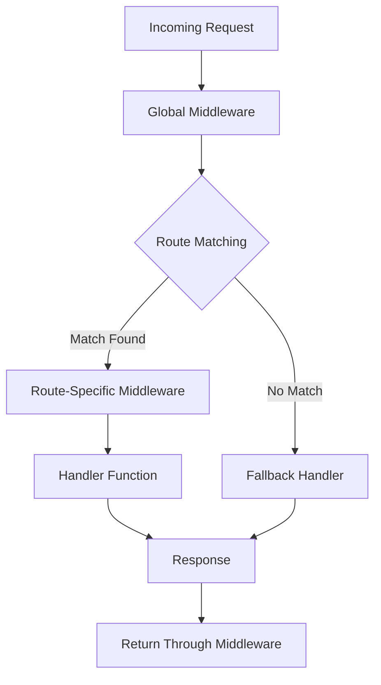

# Router API Reference

## Overview

This document provides reference information on how routing is handled within Navius applications, primarily leveraging the Axum framework's `Router`. Routing defines how incoming HTTP requests are directed to specific handler functions based on their path and method.

## Core Concepts

Routing is managed within the `Application` struct, which holds the main Axum `Router`.

```rust
// From Application struct definition
pub struct Application {
    // ... other fields ...
    router: Router,
    // ... other fields ...
}

impl Application {
    // ... other methods ...
    pub fn router(&self) -> &Router {
        &self.router
    }
    // ... other methods ...
}
```

The `ApplicationBuilder` is used to configure the router when constructing the application.

## Defining Routes

Routes are defined using the Axum `Router` methods. You typically chain `route` calls to define paths and associate them with handler functions for specific HTTP methods (like GET, POST, etc.).

```rust
use axum::{routing::{get, post}, Router};
use crate::app::handlers::{index_handler, users::{get_users, create_user, get_user_by_id}}; // Example handler paths

// Create a router
let router = Router::new()
    .route("/", get(index_handler)) // Route for the root path, GET method
    .route("/users", get(get_users).post(create_user)) // Route for /users, GET and POST methods
    .route("/users/:id", get(get_user_by_id)); // Route with a path parameter :id

// Create an application with the router (simplified builder usage)
let app = ApplicationBuilder::new("my-app")
    .with_router(router)
    .build()?;
```

## Route Groups (Nesting)

You can group related routes under a common path prefix using `nest`. This helps organize larger applications.

```rust
use axum::{routing::get, Router};
use crate::app::handlers::users::{get_users, create_user, get_user_by_id, update_user, delete_user}; // Example handler paths
use crate::app::middleware::auth_middleware; // Example middleware path
use axum::middleware;

// Define routes for an API version
fn api_v1_router() -> Router {
    Router::new()
        .route("/users", get(get_users).post(create_user))
        .route("/users/:id", get(get_user_by_id).put(update_user).delete(delete_user))
        // ... other v1 routes
}

// Nest the API router and apply middleware
let main_router = Router::new()
    .route("/", get(index_handler)) // Public route
    .nest("/api/v1", api_v1_router()) // Nest all v1 routes under /api/v1
    .layer(middleware::from_fn(auth_middleware)); // Apply auth middleware to relevant parts

let app = ApplicationBuilder::new("my-app")
    .with_router(main_router)
    .build()?;
```

## Router Configuration

### Route Parameters

Axum supports extracting parameters from routes using path variables:

```rust
// Define a route with a path parameter
app.route("/users/:id", get(get_user_by_id));

// In the handler function, extract the parameter
async fn get_user_by_id(Path(id): Path<String>) -> impl IntoResponse {
    // Use the extracted id
    // ...
}
```

### Route Fallbacks

You can define fallback routes to handle requests that don't match any defined routes:

```rust
let app = Router::new()
    .route("/", get(index_handler))
    .route("/users", get(get_users))
    // Define a fallback for routes that don't match
    .fallback(handle_404);

async fn handle_404() -> impl IntoResponse {
    (StatusCode::NOT_FOUND, "Resource not found")
}
```

## Middleware Integration

Middleware can be applied to the entire router or specific routes using `.layer()`. This allows for cross-cutting concerns like authentication, logging, and error handling.

```rust
// Apply middleware to all routes
let app = Router::new()
    .route("/", get(index_handler))
    .route("/users", get(get_users))
    .layer(middleware::from_fn(logging_middleware))
    .layer(middleware::from_fn(error_handling_middleware));

// Apply middleware to specific routes or route groups
let protected_routes = Router::new()
    .route("/profile", get(profile_handler))
    .route("/settings", get(settings_handler))
    .layer(middleware::from_fn(auth_middleware));

let app = Router::new()
    .route("/", get(index_handler)) // Public route
    .nest("/account", protected_routes) // Protected routes with auth middleware
    .layer(middleware::from_fn(logging_middleware)); // Global middleware
```

## Implementation Details

### Router Lifecycle

1. **Route Definition**: Routes are defined using `Router::new()` and `.route()` methods
2. **Router Configuration**: The router is configured with middleware, fallbacks, and nested routes
3. **Router Integration**: The router is passed to the `ApplicationBuilder` 
4. **Request Handling**: 
   - Incoming request is received
   - Global middleware is applied
   - Route matching is performed
   - Route-specific middleware is applied
   - Handler function is executed
   - Response is returned through the middleware chain

### Request Flow Diagram



### Best Practices

- **Route Organization**: Group related routes using nested routers
- **Route Naming**: Use RESTful conventions for route naming
- **Middleware Application**: Apply middleware at the appropriate level (global vs. route-specific)
- **Error Handling**: Implement proper error handling middleware
- **Security**: Apply authentication and authorization middleware to protected routes

## Examples

### Basic API Router

```rust
use axum::{
    routing::{get, post, put, delete},
    Router,
};
use crate::app::handlers::api;

pub fn create_api_router() -> Router {
    Router::new()
        .route("/health", get(api::health_check))
        .route("/products", get(api::get_products).post(api::create_product))
        .route("/products/:id", 
            get(api::get_product_by_id)
            .put(api::update_product)
            .delete(api::delete_product)
        )
}
```

### Versioned API Router

```rust
use axum::{
    routing::{get, post},
    Router,
};
use crate::app::handlers::{api_v1, api_v2};

pub fn create_versioned_api_router() -> Router {
    // V1 API routes
    let v1_routes = Router::new()
        .route("/users", get(api_v1::get_users).post(api_v1::create_user))
        .route("/users/:id", get(api_v1::get_user_by_id));
        
    // V2 API routes
    let v2_routes = Router::new()
        .route("/users", get(api_v2::get_users).post(api_v2::create_user))
        .route("/users/:id", get(api_v2::get_user_by_id))
        .route("/users/:id/profile", get(api_v2::get_user_profile));
        
    // Main router with versioned APIs
    Router::new()
        .route("/health", get(health_check))
        .nest("/api/v1", v1_routes)
        .nest("/api/v2", v2_routes)
}
```

### Authentication Protected Routes

```rust
use axum::{
    routing::{get, post},
    Router,
    middleware,
};
use crate::app::middleware::auth;
use crate::app::handlers::{public, protected};

pub fn create_protected_router() -> Router {
    // Public routes that don't require authentication
    let public_routes = Router::new()
        .route("/", get(public::index))
        .route("/about", get(public::about))
        .route("/login", post(public::login));
        
    // Protected routes that require authentication
    let protected_routes = Router::new()
        .route("/dashboard", get(protected::dashboard))
        .route("/profile", get(protected::profile).put(protected::update_profile))
        .route("/settings", get(protected::settings).put(protected::update_settings))
        .layer(middleware::from_fn(auth::require_auth));
        
    // Combine routes
    Router::new()
        .merge(public_routes)
        .merge(protected_routes)
}
```

## Troubleshooting

### Common Issues

| Issue | Possible Cause | Solution |
|-------|---------------|----------|
| Route not matching | Incorrect path pattern | Double-check route path patterns, especially parameter syntax |
| Middleware not running | Incorrect middleware order | Ensure middleware is added in the correct order (first added, last executed) |
| Handler receiving wrong parameters | Incorrect extractor usage | Verify parameter extractors match route definition |
| Route conflicts | Multiple routes with same pattern | Check for duplicate route definitions or overlapping patterns |
| Protected route accessible | Missing authentication middleware | Ensure auth middleware is applied to all protected routes |

### Debugging Routes

For debugging routes during development:

```rust
// Print the router route table for debugging
println!("Router debug: {:#?}", app);

// Add tracing middleware to see route resolution
let app = Router::new()
    .route("/", get(index_handler))
    .layer(middleware::from_fn(|req, next| async {
        println!("Request path: {}", req.uri().path());
        next.run(req).await
    }));
```

## Related Documents

- [Application API Reference](./application-api.md)
- [API Integration Guide](../../04_guides/features/api-integration.md)
- [Custom Middleware Guide](../../04_guides/middleware/custom-middleware.md)
- [Axum Router Documentation](https://docs.rs/axum/latest/axum/routing/struct.Router.html)
