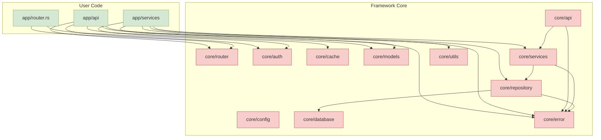
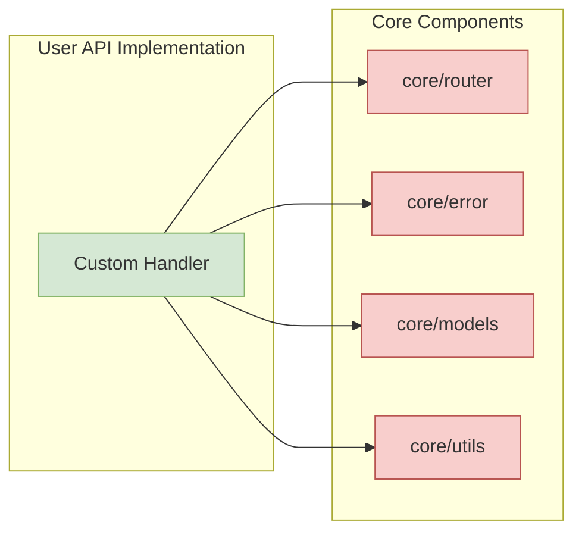
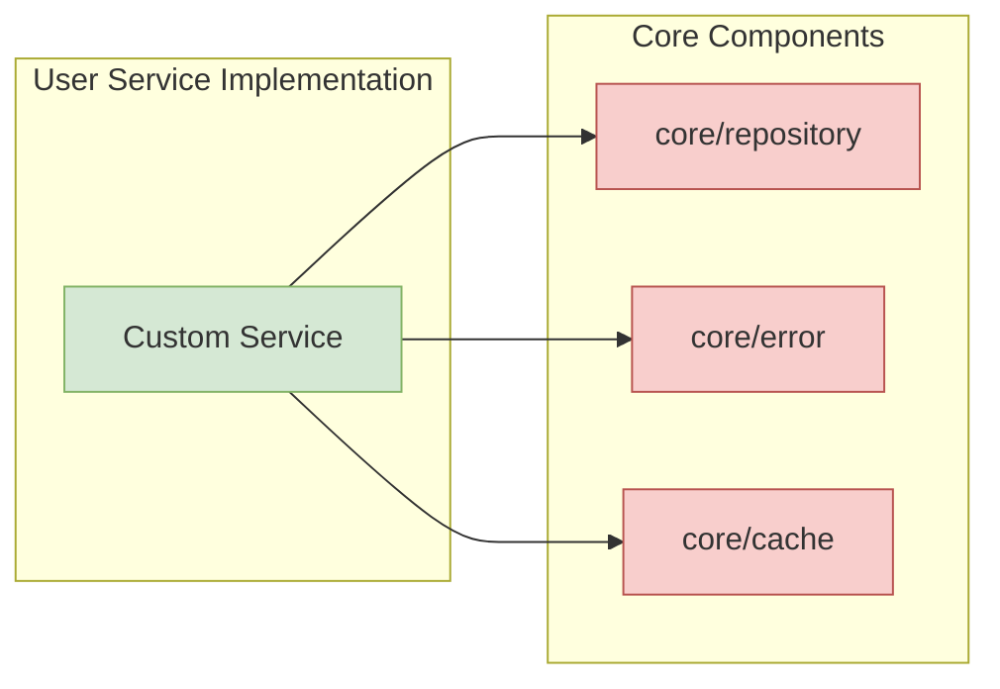
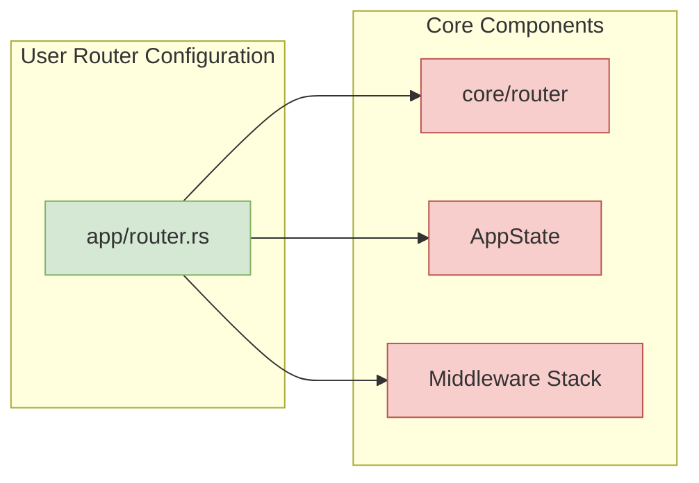

# App-Core Interactions

This diagram illustrates how the user-facing `src/app` components interact with the framework's `src/core` components.

## Extension Patterns

The diagram illustrates the key extension patterns used in the Navius framework:

### 1. API Extension Pattern

### 2. Service Extension Pattern

### 3. Router Extension Pattern

## Dependency Flow Guidelines

For maintainability and clean architecture, dependencies should flow according to these guidelines:

1. **User code depends on core code**, not the other way around
2. **Core code should never depend on user code**
3. **App components should depend only on their corresponding core components**
4. **Cross-cutting concerns (error, config) may be used by any component**

Following these guidelines ensures:

- **Separation of concerns** between framework and application code
- **Testability** of user code in isolation
- **Upgradability** of the framework without breaking user code
- **Extensibility** through well-defined interfaces 

## Related Documents
- [Project Structure](../project-structure.md) - Overall structure
- [Module Dependencies](../module-dependencies.md) - Dependencies between modules

