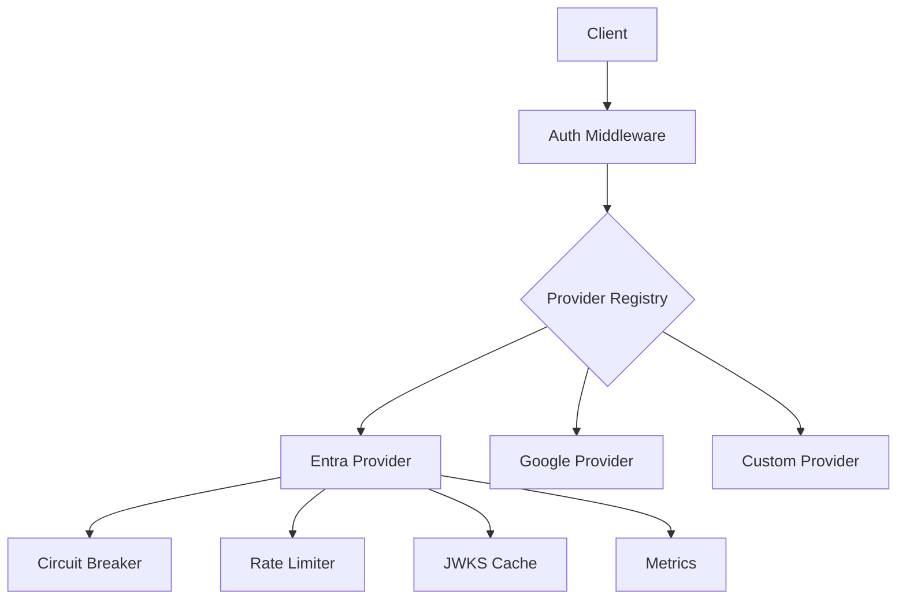

## Circuit Breaker Configuration

The authentication system implements circuit breakers to prevent cascading failures:

## Monitoring Dashboard

Recommended Grafana dashboard metrics:
- Authentication success/failure rates
- JWKS cache validity status
- Circuit breaker state per provider
- Rate limit utilization
- Token validation latency percentiles

Alerting thresholds:
- Circuit breaker open > 5 minutes
- JWKS validity < 1 minute remaining
- Token validation failure rate > 5%

```yaml
auth:
  providers:
    entra:
      circuit_breaker:
        reset_timeout_seconds: 60  # Time before attempting to close
```

States:
- **Closed**: Normal operation
- **Open**: Temporarily disabled after threshold failures
- **Half-Open**: Testing if failures have resolved

Monitor via health check endpoint:
```json
{
  "circuit_state": "closed|open|half-open"
}
```
```

**5. Update Tests:**
```rust:tests/auth/providers.rs
#[tokio::test]
async fn test_circuit_breaker() {
    let config = load_test_config();
    let registry = ProviderRegistry::from_app_config(&config).unwrap();
    let provider = registry.get_provider("entra").unwrap();
    
    // Force circuit to open
    for _ in 0..5 {
        let _ = provider.validate_token("invalid").await;
    }
    
    // Next request should fail fast
    assert!(matches!(
        provider.validate_token("valid").await,
        Err(AuthError::CircuitOpen)
    ));
    
    // Wait for reset timeout
    tokio::time::sleep(Duration::from_secs(60)).await;
    
    // Should be in half-open state
    let status = provider.health_check().await;
    assert_eq!(status.circuit_state, "half-open");
}
```

**6. Update Error Handling:**
```rust:src/core/auth/error.rs
#[derive(Debug, thiserror::Error)]
pub enum AuthError {
    // ... existing variants ...
    #[error("Circuit breaker open: {0}")]
    CircuitOpen(String),
}
```

**Final System Architecture:**


**Deployment Considerations:**
1. Add Prometheus annotations for metrics scraping
2. Configure alerting on `auth_provider_ready` metric
3. Set up dashboard for authentication system health

Would you like me to provide implementation details for any of these final components or make adjustments to existing code?
