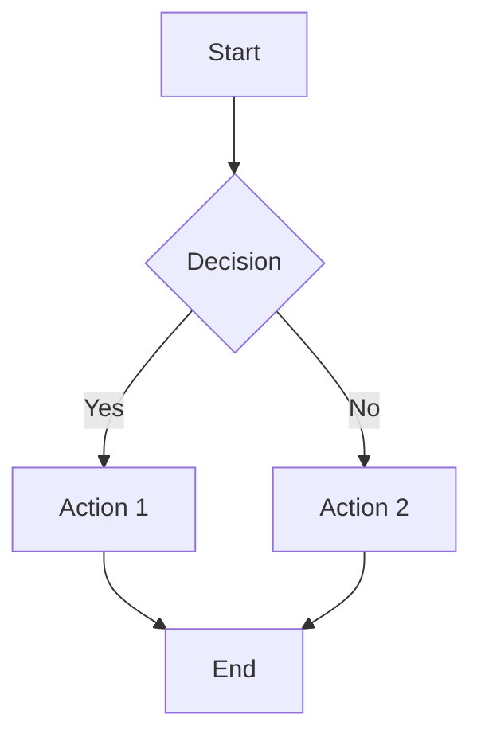
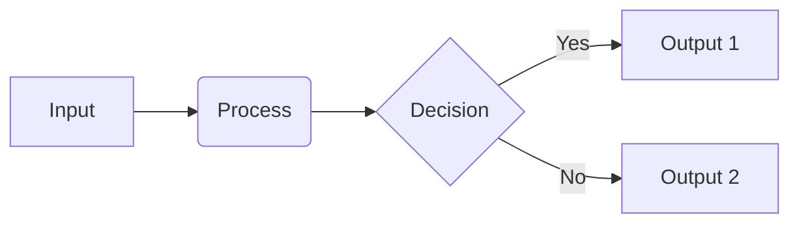
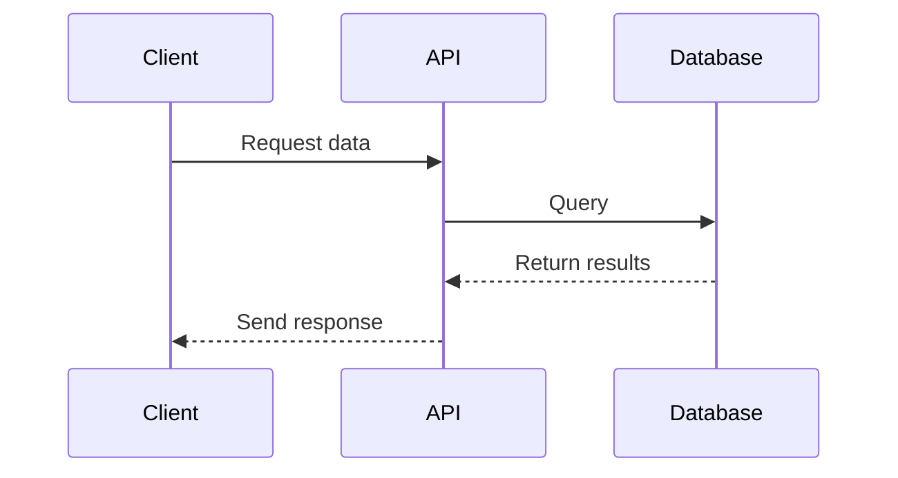
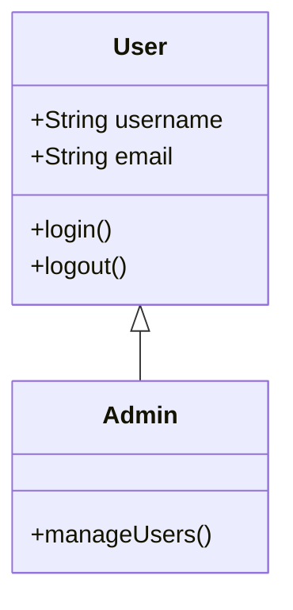
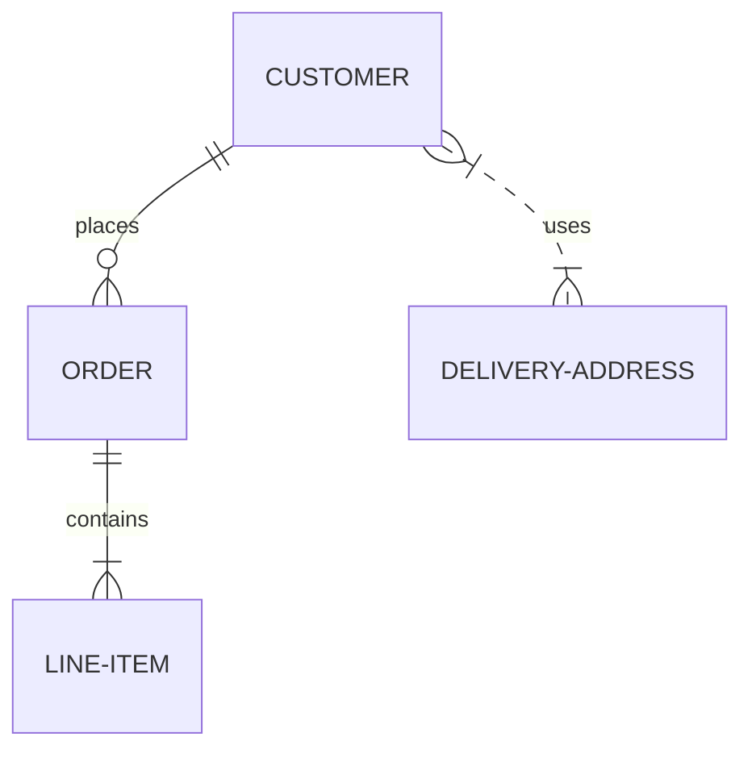

# Documentation Standards

> **IMPORTANT**: The primary source of truth for documentation standards and structure is maintained in:
> - [Documentation Reorganization Roadmap](../../98_roadmaps/30_documentation-reorganization-roadmap.md)
> - [Documentation Reorganization Instructions](../../98_roadmaps/30_documentation-reorganization-instructions.md)
>
> This document provides a high-level overview and redirects to the authoritative sources.

## Overview

This document serves as a reference point for the documentation standards used in the Navius project. Rather than duplicating content, it directs developers and contributors to the authoritative sources.

## Quick Reference Checklist

Use this checklist to ensure your documentation meets our standards:

- [ ] **Metadata**
  - [ ] YAML frontmatter with required fields (title, description, category, last_updated)
  - [ ] Relevant tags added
  - [ ] Related documents linked

- [ ] **Structure**
  - [ ] Title as single H1 heading
  - [ ] All required sections included based on document type
  - [ ] Logical heading hierarchy (no skipped levels)
  - [ ] "Related Documents" section included

- [ ] **Formatting**
  - [ ] Code blocks have language specifiers
  - [ ] Lists properly formatted and indented
  - [ ] Tables are properly aligned
  - [ ] Images have descriptive alt text

- [ ] **Links**
  - [ ] Internal links use absolute paths
  - [ ] External links use full URLs
  - [ ] No broken links

- [ ] **Accessibility**
  - [ ] Color isn't the only way to convey information
  - [ ] Images have meaningful alt text
  - [ ] Tables include proper headers
  - [ ] Content is organized for screen readers

- [ ] **Diagrams**
  - [ ] Complex concepts visualized with Mermaid diagrams
  - [ ] Diagrams have text alternatives

- [ ] **Validation**
  - [ ] Documentation passes all validation tools

## Authoritative Documentation

### Primary Sources

1. [**Documentation Reorganization Roadmap**](../../98_roadmaps/30_documentation-reorganization-roadmap.md)
   - Defines the overall documentation structure
   - Details the validation tools and their integration
   - Establishes success criteria and metrics
   - Outlines the implementation phases

2. [**Documentation Reorganization Instructions**](../../98_roadmaps/30_documentation-reorganization-instructions.md)
   - Provides detailed implementation guidelines
   - Defines document templates and section requirements
   - Includes comprehensive migration processes
   - Documents the validation tools and their options

### Supplementary Resources

1. [**Documentation Testing Tools**](../../../.devtools/scripts/doc-overhaul/documentation-testing.md)
   - Documents the tools available for validation
   - Provides usage examples
   - Explains integration with CI/CD pipelines

## Key Standards Summary

For quick reference, here are the key standards that all documentation should follow:

1. **Required Metadata**
   - All documents must have a YAML frontmatter with title, description, category, and last_updated fields
   - Related documents and tags are strongly recommended

2. **Required Sections by Document Type**
   - All documents must have document-type-specific sections as defined in the reorganization instructions
   - Getting Started documents: Overview, Prerequisites, Installation, Usage, Troubleshooting, Related Documents
   - Guides: Overview, Prerequisites, Usage, Configuration, Examples, Troubleshooting, Related Documents
   - Reference: Overview, Configuration, Examples, Implementation Details, Related Documents
   - Examples: Overview, Prerequisites, Usage, Related Documents
   - Contributing: Overview, Prerequisites, Related Documents
   - Architecture: Overview, Implementation Details, Related Documents
   - Roadmaps: Overview, Current State, Target State, Implementation Phases, Success Criteria, Related Documents
   - At minimum, all documents should have "Overview" and "Related Documents" sections

3. **Document Structure**
   - Documents must follow a consistent heading structure
   - Code examples must use appropriate syntax highlighting
   - Internal links must use absolute paths from the project root
   - Implementation Details sections should include Mermaid diagrams where appropriate

4. **Validation**
   - All documentation should pass the validation provided by the testing tools
   - Use the add_sections.sh script to ensure consistent document structure
   - Use the fix_frontmatter.sh script to validate metadata
   - Use the fix_links.sh script to validate links

## Implementation Tools

The `.devtools/scripts/doc-overhaul/` directory contains tools for implementing and validating these standards:

- **generate_report.sh**: Comprehensive quality reports with health scores and recommendations
- **add_sections.sh**: Adding standardized sections based on document type with support for both directory structures
- **fix_frontmatter.sh**: Validating and fixing document metadata including automatic date handling
- **fix_links.sh**: Verifying and repairing document links with intelligent path suggestions
- **comprehensive_test.sh**: In-depth documentation analysis with detailed quality metrics
- **improve_docs.sh**: Interactive documentation improvement workflow that:
  - Guides users through step-by-step document improvement processes
  - Provides batch operations for fixing common documentation issues
  - Calculates and reports readability metrics with improvement suggestions
  - Automatically updates frontmatter metadata including last_updated field
  - Generates quality reports with visualization options
  - Supports both old and new directory structures
  - Integrates all other documentation tools in a streamlined workflow

### New Validation Tools

As part of the documentation reorganization, we've developed a set of specialized validation tools in the `11newdocs11/98_roadmaps/doc-reorg-tools/` directory:

- **code-example-extractor.sh**: Extracts Rust code examples from Markdown files for verification
- **code-example-verifier.sh**: Validates Rust code examples for syntactic correctness and API compatibility
- **code-example-fixer.sh**: Automatically fixes common issues in code examples
- **link-analyzer.sh**: Checks internal links for correctness in the new directory structure
- **document-validator.sh**: Validates document structure, frontmatter, and content quality
- **run-consolidated-validation.sh**: Integrated validation script that runs all tools and generates a consolidated report

#### Simplified Validation Tools

To address challenges with the more complex validation tools, we've also created simplified alternatives that are easier to use and more reliable:

- **simple-validate.sh**: Validates a single document's frontmatter, structure, code examples, and links
- **simple-batch-validate.sh**: Runs validation on multiple documents and generates a consolidated report
- **generate-summary.sh**: Creates an executive summary of validation results with actionable recommendations

These tools provide basic validation capabilities with minimal dependencies and are recommended for initial validation passes. For detailed instructions on using these simplified validation tools, see the [Documentation Validation Tools README](../../98_roadmaps/doc-reorg-tools/README.md).

#### Tiered Validation Approach

To efficiently validate the large number of documents, we implement a three-tier validation approach:

1. **Tier 1 (100% Validation)**
   - Getting started guides
   - Installation instructions
   - Core API references
   - Frequently accessed examples

2. **Tier 2 (50% Sample Validation)**
   - Secondary examples
   - Feature-specific guides
   - Specialized patterns
   - Contributing guidelines

3. **Tier 3 (Spot Checking)**
   - Supplementary materials
   - Advanced topics
   - Historical roadmaps
   - Specialized configurations

For detailed instructions on using these validation tools, see the [Consolidated Validation Script Usage Guide](../../98_roadmaps/doc-reorg-tools/consolidated-validation-usage.md).

## Writing Style Guide

Consistent writing style is as important as consistent formatting. Follow these guidelines for clear, accessible content:

### Voice and Tone

- Use a **clear, direct tone** that focuses on helping the reader
- Write in the **present tense** ("the function returns" not "the function will return")
- Use **active voice** over passive voice when possible
- Address the reader as **"you"** rather than "we" or "the user"
- Be **conversational but professional** (avoid slang but don't be overly formal)

### Content Structure

- Start with the **most important information** first
- Use **short paragraphs** (3-5 sentences maximum)
- Include a **brief overview** at the beginning of each document
- Provide **concrete examples** for complex concepts
- Use **numbered lists for sequential steps** and **bulleted lists for unordered items**

### Language Clarity

- Define **technical terms** on first use
- Use **consistent terminology** throughout documentation
- Avoid **jargon** or **abbreviations** without explanation
- Be **specific and precise** rather than vague
- Keep **sentences concise** (aim for 15-20 words average)

#### Before and After Examples

<table>
<tr>
<th>❌ Instead of this</th>
<th>✅ Write this</th>
</tr>
<tr>
<td>

The utilization of the configuration object necessitates initialization prior to implementation in your codebase, which will then subsequently enable the functionality required for operation.

</td>
<td>

Initialize the configuration object before using it in your code. This enables the core functionality.

</td>
</tr>
<tr>
<td>

We've enhanced the previous implementation with a variety of performance improvements that users will find quite advantageous when deploying in their environments.

</td>
<td>

This version improves performance by:
- Reducing memory usage by 40%
- Decreasing response time to under 100ms
- Supporting concurrent connections

</td>
</tr>
</table>

## Markdown Style Guide

The following style guide provides supplementary formatting guidance for Markdown documents:

### Document Structure

#### Metadata Header
Every document must include a YAML metadata header as specified in the reorganization instructions:

```yaml
---
title: Document Title
description: Brief description of the document
category: guides | reference | roadmaps | contributing
tags:
  - tag1
  - tag2
related:
  - path/to/related/doc1.md
  - path/to/related/doc2.md
last_updated: March 27, 2025
version: 1.0
---
```

#### Heading Structure
- Use a single `#` for the document title
- Start with `##` for main sections
- Use increasing heading levels for subsections
- Don't skip heading levels (e.g., don't go from `##` to `####`)
- Keep headings concise and descriptive

### Text Formatting

#### Paragraphs
- Use a single blank line between paragraphs
- Keep paragraphs focused on a single topic
- Aim for 3-5 sentences per paragraph maximum

#### Emphasis
- Use **bold** (`**text**`) for emphasis or UI elements
- Use *italic* (`*text*`) for introduced terms or parameters
- Use `code` (`` `code` ``) for code snippets, commands, or filenames
- Avoid using ALL CAPS for emphasis

#### Lists
- Use unordered lists (`-`) for items without specific order
- Use ordered lists (`1.`) for sequential steps or prioritized items
- Maintain consistent indentation for nested lists
- Include a blank line before and after lists

```markdown
- Item 1
- Item 2
  - Nested item 1
  - Nested item 2
- Item 3

1. First step
2. Second step
   1. Substep 1
   2. Substep 2
3. Third step
```

### Code Elements

#### Inline Code
Use backticks for inline code:
```markdown
The `Config` struct contains the application configuration.
```

#### Code Blocks
Use triple backticks with a language specifier:

````markdown
```rust
fn main() {
    println!("Hello, world!");
}
```
````

#### Command Line Examples
For command line examples, use `bash` or `shell` as the language:

````markdown
```bash
cargo run --release
```
````

### Links and References

#### Internal Links
Use absolute paths from the project root for internal links:
```markdown
See the [Installation Guide](../01_getting_started/installation.md) for more information.
```

#### External Links
Use complete URLs for external links:
```markdown
Visit the [Rust website](https://www.rust-lang.org/) for more information.
```

#### Images
Include images with alt text:
```markdown

```

### Tables

Use tables for structured data:
```markdown
| Column 1 | Column 2 | Column 3 |
|----------|----------|----------|
| Cell 1   | Cell 2   | Cell 3   |
| Cell 4   | Cell 5   | Cell 6   |
```

### Notes and Callouts

Use blockquotes with prefixes for notes and warnings:
```markdown
> **Note:** This is important information.

> **Warning:** This is a critical warning.
```

## Diagrams and Visualizations

For complex concepts, use diagrams to enhance understanding. We standardize on Mermaid for creating diagrams within Markdown.

### Using Mermaid Diagrams

Mermaid diagrams are preferred because they:
- Can be version-controlled as code
- Render correctly in GitHub/GitLab
- Are accessible with proper text alternatives
- Can be easily updated without graphic design tools

Include Mermaid diagrams using code blocks with the `mermaid` language specifier:

````markdown

````

Which renders as:


### Common Diagram Types

#### Flowcharts (Process Diagrams)
Use for depicting processes, workflows, or decision trees:

````markdown

````

#### Sequence Diagrams
Use for depicting interactions between components:

````markdown

````

#### Class Diagrams
Use for depicting relationships between classes/structs:

````markdown

````

#### Entity-Relationship Diagrams
Use for database schema representations:

````markdown

````

### Diagram Best Practices

1. **Always provide a text description** before or after complex diagrams
2. **Keep diagrams focused** on one concept
3. **Use consistent styling** across diagrams
4. **Label edges and nodes** clearly
5. **Include a legend** for complex notation
6. **Test your diagrams** in dark and light mode

## Accessibility Guidelines

Creating accessible documentation ensures that all users, including those with disabilities, can effectively use our documentation.

### Text Alternatives for Non-Text Content

- Always provide **alt text for images** that describes the content and purpose
- For complex images or diagrams, provide a **text description** that explains what the image conveys
- For decorative images that don't convey meaning, use empty alt text (`alt=""`)

#### Example:

```markdown
<!-- ❌ Poor alt text -->


<!-- ✅ Good alt text -->

```

### Headings and Structure

- Use **headings to organize content** in a logical hierarchy
- Don't skip heading levels (e.g., don't go from `##` to `####`)
- Make sure headings accurately describe the content that follows

### Links

- Use **descriptive link text** that indicates where the link leads
- Avoid using "click here" or "read more" as link text
- Ensure all links are distinguishable (not just by color)

#### Example:

```markdown
<!-- ❌ Poor link text -->
For more information about accessibility, [click here](../04_guides/accessibility.md).

<!-- ✅ Good link text -->
For more information, read the [Accessibility Guidelines](../04_guides/accessibility.md).
```

### Tables

- Use tables for **tabular data**, not for layout
- Include table headers using `|---|` syntax
- Keep tables simple and avoid merging cells
- Provide a caption or description before complex tables

### Color and Contrast

- Never use color as the **only** way to convey information
- Ensure sufficient contrast between text and background
- Test documentation in both light and dark modes

## Mobile-Friendly Content

With users increasingly accessing documentation on mobile devices, ensure content works well on small screens:

1. **Use responsive tables** or consider alternatives for wide tables
2. **Keep code examples concise** and use line breaks to prevent horizontal scrolling
3. **Optimize images** for mobile viewing (consider progressive loading)
4. **Test documentation on mobile** devices or emulators
5. **Use shorter paragraphs** for better mobile readability
6. **Prefer vertical layouts** over horizontal when possible

## Internationalization Considerations

While our primary documentation is in English, following these practices helps with future translation and international accessibility:

1. **Use simple, clear language** that's easier to translate
2. **Avoid idioms, colloquialisms, and culture-specific references**
3. **Use ISO standard date formats** (YYYY-MM-DD)
4. **Keep sentences relatively short** to aid translation
5. **Use visuals to complement text** where appropriate
6. **Provide context for potentially ambiguous terms**
7. **Structure content with clear headers** for easier navigation
8. **Use Unicode characters** rather than ASCII art

## Document Type Templates

The following templates provide examples for different document types. For the definitive list of required sections by document type, refer to the [Documentation Reorganization Instructions](../../98_roadmaps/30_documentation-reorganization-instructions.md).

### Index Documents (README.md)

```markdown
# Guide Documentation

This directory contains guides for using and developing with the Navius framework.

## Document List

- [Development Workflow](development-workflow.md) - Guide to the development process
- [Testing Guide](testing.md) - How to write and run tests
- [Authentication](authentication.md) - Setting up and using authentication

## Key Documents

If you're new to development, start with:
- [Development Workflow](development-workflow.md)
- [Project Structure](../05_reference/project-structure.md)

## Getting Started

For new developers, we recommend following these guides in order:
1. [Installation Guide](../01_getting_started/installation.md)
2. [Development Setup](../01_getting_started/development-setup.md)
3. [Development Workflow](development-workflow.md)
```

### Guide Documents

```markdown
# Authentication Guide

## Overview
This guide explains how to implement authentication in your Navius application.

## Prerequisites
- Basic understanding of Rust and Axum
- Navius development environment set up
- Access to Microsoft Entra (formerly Azure AD)

## Step-by-step Instructions
1. **Configure Environment Variables**
   ```shell
   export ENTRA_CLIENT_ID=your-client-id
   export ENTRA_TENANT_ID=your-tenant-id
   ```

2. **Add Authentication Middleware**
   ```