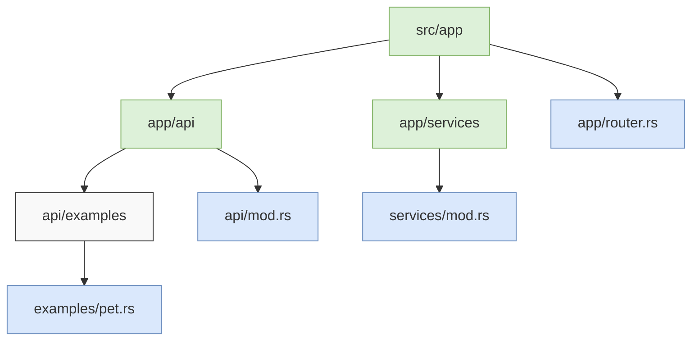
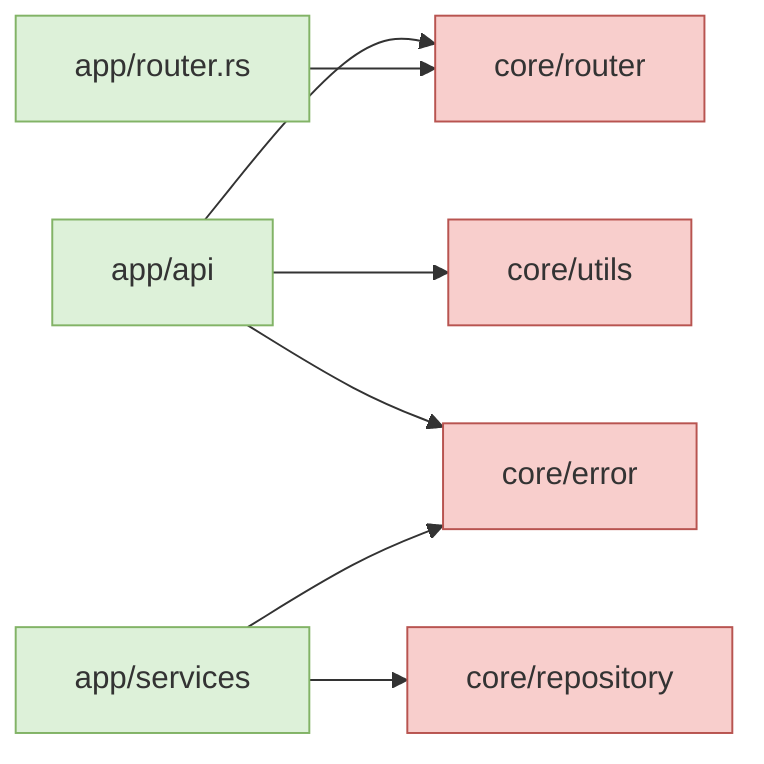

# App Module Diagram

This diagram illustrates the structure of the `src/app` directory, which contains user-facing code that can be customized or extended.

## Module Responsibilities

### app/
The `app` directory contains user-facing code that developers can customize or extend. It provides a clean separation between framework code and application-specific code.

### app/api/
Contains user-facing API endpoints that define the HTTP interfaces of the application. This is where developers should add their own API resources and endpoints.

### app/api/examples/
Contains example implementations that demonstrate how to use the framework. These examples serve as patterns for developers to follow when implementing their own APIs.

### app/services/
Contains user-facing service implementations that handle business logic. Services coordinate operations across multiple components and encapsulate complex workflows.

### app/router.rs
Defines user-specific routing logic to map HTTP requests to handlers. This file allows developers to customize how their APIs are organized and accessed.

## Extension Points

The `app` directory provides several extension points for developers:

1. **API Endpoints**: Add new API endpoints by creating modules in `app/api/` and implementing handlers.
2. **Services**: Implement business logic in `app/services/` to handle complex operations.
3. **Routes**: Define custom routes in `app/router.rs` to organize the API structure.

## Relationship with Core

The `app` modules depend on and leverage the functionality provided by the `core` modules. The typical dependencies flow like this:

## Related Documents
- [Project Structure](../project-structure.md) - Overall structure
- [Module Dependencies](../module-dependencies.md) - Dependencies between modules

