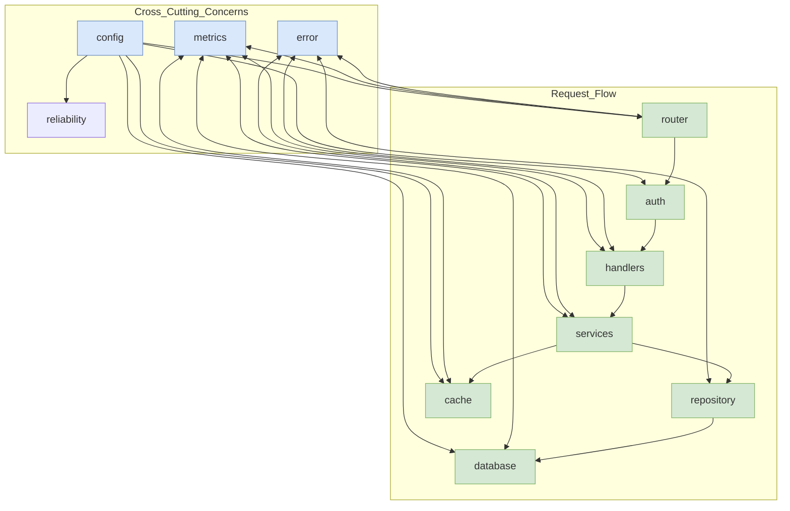

# Core Module Diagram

This diagram illustrates the structure of the `src/core` directory, which contains the framework's foundational components.

```mermaid
graph TD
    core[src/core] --> api[core/api]
    core --> router[core/router]
    core --> auth[core/auth]
    core --> cache[core/cache]
    core --> config[core/config]
    core --> database[core/database]
    core --> error[core/error]
    core --> handlers[core/handlers]
    core --> metrics[core/metrics]
    core --> models[core/models]
    core --> reliability[core/reliability]
    core --> repository[core/repository]
    core --> services[core/services]
    core --> utils[core/utils]
    
    classDef default fill:#f9f9f9,stroke:#333,stroke-width:1px;
    classDef module fill:#f8cecc,stroke:#b85450,stroke-width:1px;
    
    class core,api,router,auth,cache,config,database,error,handlers,metrics,models,reliability,repository,services,utils module;
```

## Module Responsibilities

### core/api/
Contains core API implementations and handlers that are part of the framework itself.

### core/router/
Provides core routing infrastructure, including route registration, middleware integration, and request handling.

### core/auth/
Implements authentication and authorization mechanisms, including token validation, role-based access, and security middleware.

### core/cache/
Manages caching infrastructure, supporting different cache providers and cache management strategies.

### core/config/
Handles configuration loading, validation, and access throughout the application.

### core/database/
Manages database connections, transactions, and provides database-related utilities.

### core/error/
Defines the error handling framework, including error types, conversion utilities, and error response formatting.

### core/handlers/
Contains system-level request handlers for core functionality like health checks, metrics, and documentation.

### core/metrics/
Implements metrics collection, reporting, and integration with monitoring systems.

### core/models/
Defines core data models used throughout the framework.

### core/reliability/
Implements reliability patterns such as circuit breakers, rate limiting, timeouts, and retries.

### core/repository/
Provides data access patterns and core repository implementations.

### core/services/
Contains core business logic implementations used by the framework.

### core/utils/
Offers utility functions and helpers used across the framework.

## Key Interactions

The core modules interact in specific ways to provide the framework's capabilities:

## Extension Strategy

The core modules are designed to be extended rather than modified:

1. **API Extension**: User-defined APIs in `src/app/api` use core components
2. **Service Extension**: User-defined services in `src/app/services` use core repositories and utilities
3. **Model Extension**: Custom models use core model traits and interfaces

This extension-over-modification pattern ensures that framework upgrades remain compatible with user code. 