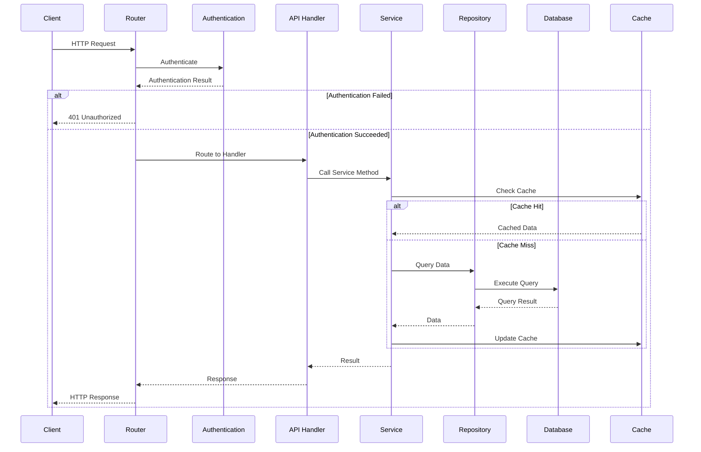
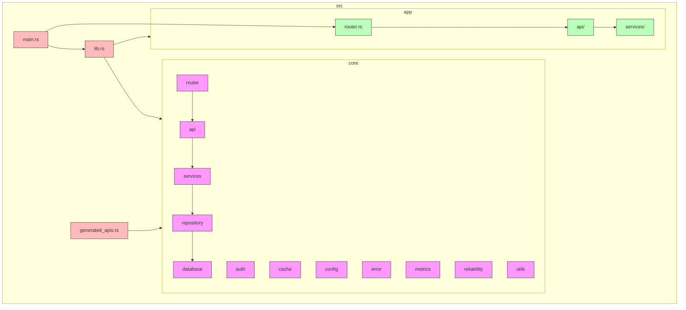
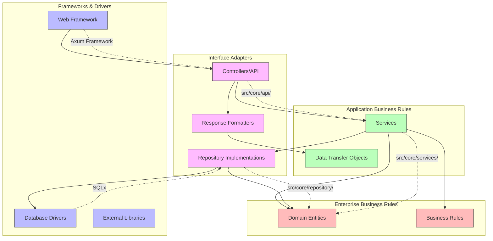

# Module Dependencies Diagram

**Updated At:** March 22, 2025

This document provides visualizations of the module dependencies in the Navius project to help developers understand the architecture.

## Core Components and Their Dependencies

```mermaid
graph TD
    subgraph Core
        Router[Router]
        API[API Handlers]
        Services[Services]
        Repository[Repository]
        Database[Database]
        Auth[Authentication]
        Cache[Cache]
        Config[Configuration]
        Error[Error Handling]
        Metrics[Metrics]
        Reliability[Reliability]
        Utils[Utilities]
    end
    
    subgraph External
        External[External APIs]
        Redis[Redis]
        Postgres[PostgreSQL]
        MSAuth[MS Entra]
    end
    
    subgraph App
        AppRouter[App Router]
        AppAPI[App API]
        AppServices[App Services]
    end
    
    %% Core Dependencies
    Router --> API
    Router --> Auth
    API --> Services
    API --> Error
    Services --> Repository
    Services --> Cache
    Services --> Error
    Repository --> Database
    Repository --> Error
    Database --> Error
    Auth --> Error
    Auth --> Config
    Cache --> Error
    Cache --> Config
    Reliability --> Error
    Reliability --> Config
    Metrics --> Error
    
    %% External Dependencies
    Database --> Postgres
    Cache --> Redis
    Auth --> MSAuth
    External --> API
    
    %% App Dependencies
    AppRouter --> Router
    AppAPI --> API
    AppServices --> Services
    AppRouter --> AppAPI
    AppAPI --> AppServices
    
    %% Legend
    classDef core fill:#f9f,stroke:#333,stroke-width:2px;
    classDef external fill:#bbf,stroke:#333,stroke-width:2px;
    classDef app fill:#bfb,stroke:#333,stroke-width:2px;
    
    class Router,API,Services,Repository,Database,Auth,Cache,Config,Error,Metrics,Reliability,Utils core;
    class External,Redis,Postgres,MSAuth external;
    class AppRouter,AppAPI,AppServices app;
```

## Request Flow



## Core Module Structure



## Clean Architecture View



## How to View These Diagrams

These diagrams are written in Mermaid format, which can be viewed in several ways:

1. **GitHub Rendering**: If viewing on GitHub, the diagrams will render automatically

2. **VS Code Extension**: Install the "Markdown Preview Mermaid Support" extension in VS Code

3. **Mermaid Live Editor**: Copy the diagram code and paste it into the [Mermaid Live Editor](https://mermaid.live)

4. **Browser Extension**: Use a browser extension like "Mermaid Diagrams" for Chrome 