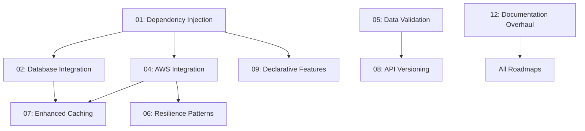

# Navius Framework Roadmaps

This directory contains roadmaps for enhancing the Navius framework to match the feature set and developer experience of established enterprise frameworks like Spring Boot.

## Quick Links

- [Template for Updates](template-for-updating.md) - Guidelines for updating roadmaps
- [Server Customization System](26-server-customization-system.md) - **Foundation priority** (96% complete)
- [Generic Service Implementations](25-generic-service-implementations.md) - **Top priority** (71% complete)
- [Testing Framework](03-testing-framework.md) - Current focus area (35% complete)
- [Enhanced Caching](07-enhanced-caching.md) - Active development (40% complete)
- [Dependency Injection](01-dependency-injection.md) - High priority focus area
- [Project Status Dashboard](#current-implementation-status) - Overall project status
- [Roadmap Instructions](roadmap-instructions/README.md) - Implementation guides for roadmaps

## Active Roadmaps

| ID | Roadmap | Status | Priority | Dependencies |
|----|---------|--------|----------|--------------|
| 17 | [Server Customization System](26-server-customization-system.md) | 96% | **Critical** | None |
| 16 | [Generic Service Implementations](25-generic-service-implementations.md) | 71% | **Critical** | None |
| 03 | [Testing Framework](03-testing-framework.md) | 35% | High | None |
| 07 | [Enhanced Caching](07-enhanced-caching.md) | 40% | High | 02, 04 |
| 01 | [Dependency Injection](01-dependency-injection.md) | 0% | High | None |
| 10 | [Developer Experience](10-developer-experience.md) | 10% | High | None |
| 05 | [Data Validation](05-data-validation.md) | 0% | High | None |
| 12 | [Documentation Overhaul](12_document_overhaul.md) | 0% | Medium | None |
| 11 | [Security Features](11-security-features.md) | 0% | High | None |
| 02 | [Database Integration](02-database-integration.md) | 0% | High | 01 |
| 04 | [AWS Integration](04-aws-integration.md) | 0% | Medium | 01 |
| 06 | [Resilience Patterns](06-resilience-patterns.md) | 0% | Medium | 04 |
| 08 | [API Versioning](08-api-versioning.md) | 0% | Low | 05 |
| 09 | [Declarative Features](09-declarative-features.md) | 0% | Low | 01 |
| 15 | [API Model Management](15-api-model-management.md) | 0% | High | None |

## Completed Roadmaps

| ID | Roadmap | Completion Date | Location |
|----|---------|----------------|-----------|
| 11 | [Project Structure Improvements](completed/11_project_structure_future_improvements.md) | March 24, 2025 | completed/ |
| 12 | [Project Restructuring](completed/project-restructuring.md) | March 24, 2025 | completed/ |
| 13 | [App Directory Completion](completed/app-directory-completion.md) | March 24, 2025 | completed/ |
| 14 | [Module Relocation Summary](completed/module-relocation-summary.md) | March 24, 2025 | completed/ |
| 15 | [Project Restructuring Summary](completed/project-restructuring-summary.md) | March 24, 2025 | completed/ |

## Current Implementation Status

### Overall Progress
```
[███████░░░] 52% Complete
```

| Component | Progress | Status | Next Milestone |
|-----------|----------|--------|----------------|
| Server Customization | 96% | 🔄 In Progress | CLI Visualization |
| Generic Services | 71% | 🔄 In Progress | Observability Service Generalization |
| Project Structure | 100% | ✅ Complete | N/A |
| Testing Framework | 35% | 🔄 In Progress | API Resource Testing |
| Enhanced Caching | 40% | 🔄 In Progress | Cache Monitoring and Metrics |
| Dependency Injection | 0% | 🔄 Starting | AppState Builder |
| Developer Experience | 10% | 🔄 In Progress | Local Dev Environment |
| Data Validation | 0% | 🔄 Starting | Validation Framework |
| Security Features | 0% | ⏳ Not Started | Auth Implementation |
| Documentation | 0% | ⏳ Not Started | Documentation Audit |

### Testing Coverage

| Module | Coverage | Change | Status |
|--------|----------|--------|--------|
| Core Modules | 98% | +0% | ✅ |
| API Resource | 40% | +40% | 🔄 |
| User Management | 35% | +0% | 🔄 |
| Authentication | 45% | +0% | 🔄 |
| Overall | 35% | +29% | 🔄 |

## Implementation Strategy

### Current Sprint Focus (March-April 2025)

1. **Testing Framework Enhancement**
   - Complete API Resource Testing (40% → 80%)
   - Implement Core Reliability Component tests
   - Add database operation integration tests
   - Target: Maintain 98% core coverage

2. **Dependency Injection**
   - Implement AppState builder
   - Define service traits
   - Add error handling
   - Target: Reach 30% completion

3. **Developer Experience**
   - Complete Docker Compose setup
   - Implement hot reload
   - Add development testing tools
   - Target: Reach 40% completion

4. **Data Validation**
   - Define validation framework
   - Implement input validation decorators
   - Add schema-based validation
   - Target: Reach 25% completion

5. **Enhanced Caching**
   - Improve monitoring and metrics
   - Implement cache consistency mechanisms 
   - Optimize cache performance
   - Target: Reach 60% completion

6. **Documentation Overhaul**
   - Complete documentation audit
   - Define document standards
   - Start reorganizing documentation structure
   - Target: Reach 25% completion

7. **Security Features**
   - Begin auth implementation
   - Define security boundaries
   - Implement core security utilities
   - Target: Reach 20% completion

### Roadmap Dependencies



## Quality Gates

Every roadmap implementation must pass these gates:

### 1. Testing Requirements
- [ ] 80%+ unit test coverage
- [ ] Integration tests for external services
- [ ] Performance tests for critical paths
- [ ] Security test coverage

### 2. Documentation Requirements
- [ ] API documentation
- [ ] Example code
- [ ] Architecture decisions
- [ ] Security considerations

### 3. Security Requirements
- [ ] Security scan passed
- [ ] Auth/authz implemented
- [ ] Secure configuration
- [ ] Error handling reviewed

### 4. Performance Requirements
- [ ] Load testing complete
- [ ] Resource usage analyzed
- [ ] Scalability verified
- [ ] Monitoring implemented

## Progress Tracking

Each roadmap follows our standardized tracking system:

1. **Task Status Markers**
   - [x] Completed
   - [~] In Progress
   - [ ] Not Started
   - [-] Abandoned

2. **Progress Updates**
   - Include current system date
   - Specific implementation details
   - Clear status messages
   - No future dates

3. **Coverage Tracking**
   - Use `navius-coverage.json`
   - Generate HTML reports
   - Track weekly baselines
   - Monitor critical paths

## Contributing

1. Follow the [template](template-for-updating.md) for all updates
2. Use the current system date (`date "+%B %d, %Y"`)
3. Include specific implementation details
4. Update overall progress metrics
5. Maintain documentation quality

## Roadmap Implementation Instructions

Detailed implementation guides for roadmaps are available in the [roadmap-instructions](roadmap-instructions/README.md) directory. These provide step-by-step guidance, specific prompts, and verification steps for completing roadmap tasks.

Currently available implementation guides:
- [Project Restructuring Guide](roadmap-instructions/project-restructuring-guide.md)
- [Documentation Overhaul Guide](roadmap-instructions/documentation-overhaul-guide.md)

## References

- [Rust Documentation Guidelines](https://doc.rust-lang.org/rustdoc/what-is-rustdoc.html)
- [Semantic Versioning](https://semver.org/)
- [Conventional Commits](https://www.conventionalcommits.org/)
- [Testing Best Practices](https://doc.rust-lang.org/book/ch11-00-testing.html) 

## Documentation Roadmaps

- [30_documentation-reorganization-roadmap.md](30_documentation-reorganization-roadmap.md) - Strategic plan for restructuring Navius documentation
- [30_documentation-reorganization-instructions.md](30_documentation-reorganization-instructions.md) - Implementation instructions for documentation restructuring
