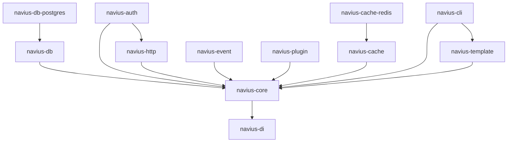

# Navius API Inventory Summary

**Generated:** March 29, 2025  
**Framework Version:** 0.4.0-dev  
**Tool Version:** 0.1.0

## Overview

- **Total Crates:** 12
- **Total Public Items:** 342
- **Documentation Coverage:** 76%
- **Public Types:** 128
- **Public Functions:** 189
- **Public Traits:** 25

## Documentation Status

| Status | Count | Percentage |
|--------|-------|------------|
| Complete | 212 | 62% |
| Partial | 48 | 14% |
| Missing | 82 | 24% |

## Crate Summary

| Crate | Public Items | Doc Coverage | Status |
|-------|--------------|--------------|--------|
| navius-core | 87 | 92% | ✅ |
| navius-http | 64 | 83% | ✅ |
| navius-db | 51 | 78% | ⚠️ |
| navius-auth | 42 | 66% | ❌ |
| navius-di | 35 | 94% | ✅ |
| navius-cache | 23 | 87% | ✅ |
| navius-event | 18 | 72% | ⚠️ |
| navius-cache-redis | 16 | 56% | ❌ |
| navius-db-postgres | 15 | 60% | ❌ |
| navius-plugin | 14 | 79% | ⚠️ |
| navius-template | 12 | 83% | ✅ |
| navius-cli | 8 | 88% | ✅ |

## API Breakdown by Type

| API Type | Count | Percentage |
|----------|-------|------------|
| Structs | 89 | 26% |
| Enums | 39 | 11% |
| Traits | 25 | 7% |
| Functions | 189 | 56% |

## Cross-Crate Dependencies

## Documentation Gap Analysis

| Crate | Missing Docs | Critical Items |
|-------|--------------|----------------|
| navius-auth | 14 | `AuthProvider`, `Credentials` |
| navius-db | 11 | `QueryBuilder` |
| navius-cache-redis | 7 | `RedisConnection` |
| navius-db-postgres | 6 | `PostgresTransaction` |
| navius-event | 5 | `EventDispatcher` |
| navius-plugin | 3 | None |
| navius-http | 11 | None |
| navius-core | 7 | None |
| navius-di | 2 | None |
| navius-cache | 3 | None |
| navius-template | 2 | None |
| navius-cli | 1 | None |

## Interface Consistency Analysis

### Naming Patterns

- **Inconsistent method prefixes**: Found 12 instances where similar methods use different verb prefixes.
  - Example: `get_user()` vs `fetch_account()` vs `retrieve_profile()`
  
- **Inconsistent parameter naming**: Found 28 instances where similar parameters use different names across methods.
  - Example: `user_id` vs `userId` vs `id`

### Parameter Ordering

- **Inconsistent parameter order**: Found 9 instances where similar methods order parameters differently.
  - Example: `connect(config, timeout)` vs `open(timeout, config)`

### Error Handling

- **Mixed error types**: Found 17 instances where related functions return different error types.
  - Example: `DatabaseError` vs `String` error messages vs custom errors

## Action Items

1. **High Priority**:
   - Complete documentation for the 37 critical items identified in the gap analysis
   - Standardize error handling patterns across the `navius-auth`, `navius-db`, and `navius-cache-redis` crates

2. **Medium Priority**:
   - Resolve the 12 identified naming inconsistencies
   - Standardize parameter ordering in the 9 identified instances
   - Complete documentation for all public traits

3. **Low Priority**:
   - Add examples to all public functions
   - Improve cross-referencing between related APIs

## Next Steps

1. Review the detailed per-crate reports for specific issues and recommendations
2. Begin the Design Evaluation phase of the API Review process
3. Schedule cross-team discussions for the major inconsistencies identified
4. Update the API Review timeline based on the findings

---

*For detailed per-crate reports, see the individual crate files in this directory.* 